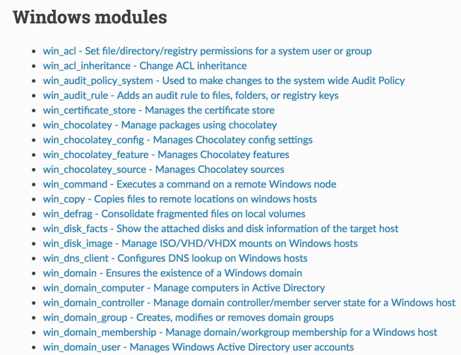

## @color[#2e75e8](PowerShell) + @color[#C51A00](Ansible)
### Playbooks, DSC, Roles and more

---

### Agenda

- Introduction.
- Ad-hoc modules.
- Playbooks.
- Desired State Configuration (DSC).
- Roles.

---

### Ansible

@size[30px](Ansible is open source software that automates software provisioning, configuration management, and application deployment.)

@ol[](false)
- Configurations stored in YAML (dot yml)
- Uses pre-configured WinRM to communicate with Windows
- Runs on a control linux system (or WSL)
@olend

---

### Modules

@size[18px](Index of modules can be found at:)
@size[20px]([https://docs.ansible.com/ansible/latest/modules/list_of_windows_modules.html](https://docs.ansible.com/ansible/latest/modules/list_of_windows_modules.html))



---

### Inventory

@size[25px](Defaults to `/etc/ansible/hosts` and may be represented as either INI or YAML. Can be overridden with `-i ./acme_inventory`.)

```ini
dockerlin.piccola.us

[windows-servers]
ansi-node-01.ad.piccola.us
ansi-node-02.ad.piccola.us

[web-servers]
ansi-node-02.ad.piccola.us
```
@[1]
@[3]
@[3-5]
@[7-8]
@[1-8]

---

### Module Example

@size[25px](win_user - Manages local Windows user accounts)

```plaintext
> ansible windows_servers `
    -m win_user `
    -a "name=vagrant state=absent"

ansi-node-01.ad.piccola.us | SUCCESS => {
    "changed": true,
    "msg": "User 'vagrant' deleted successfully",
    "name": "vagrant",
    "state": "absent"
}
```
@[1]
@[2]
@[3]
@[5-10]
@[1-10]

---

### Playbooks

@ol[](false)
- Written in YAML (dot yml).
- Made up of tasks that call modules.
- Order and organize tasks.
- Allow for code reusability.
@olend

---

### Playbooks cont.

```yml
- hosts: windows-servers
  vars:
    backup_admin_account: corpadmin
    sec_log_size_in_bytes: 25165824
  tasks:
  - my 1st task
  - my 2nd task
```
@[]
@[1]
@[2-4]
@[5]
@[5-6]
@[5-7]
@[1-7]

---

### Tasks

```yml
  tasks:
  - name: Ensure user bob is present
    win_user:
      name: bob
      password: B0bP4ssw0rd
      state: present
      groups:
        - Administrators
        - Users
```
@[1]
@[2]
@[3]
@[4]
@[4-9]
@[1-9]

---