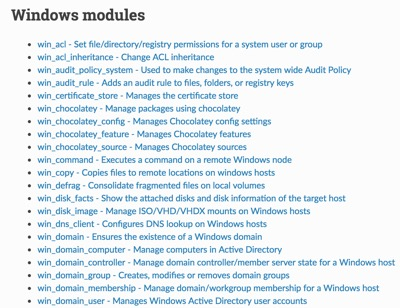

## @color[#2e75e8](PowerShell) + @color[#C51A00](Ansible)
### Playbooks, DSC, Roles and more

---

### Agenda

- Introduction.
- Ad-hoc modules.
- Playbooks.
- Desired State Configuration (DSC).
- Roles.

---

### Ansible

@size[30px](Ansible is open source software that automates software provisioning, configuration management, and application deployment.)

@ol[](false)
- Configurations stored in YAML (dot yml)
- Uses pre-configured WinRM to communicate with Windows
- Runs on a control linux system (or WSL)
@olend

---

### Modules

@size[18px](Index of modules can be found at:)
@size[20px]([https://docs.ansible.com/ansible/latest/modules/list_of_windows_modules.html](https://docs.ansible.com/ansible/latest/modules/list_of_windows_modules.html))



---

### Inventory

@size[25px](Defaults to `/etc/ansible/hosts` and may be represented as either INI or YAML. Can be overridden with `-i ./acme_inventory`.)

```ini
dockerlin.piccola.us

[windows-servers]
ansi-node-01.ad.piccola.us
ansi-node-02.ad.piccola.us

[web-servers]
ansi-node-02.ad.piccola.us
```
@[1]
@[3]
@[3-5]
@[7-8]
@[1-8]

---

### Module Example

@size[25px](win_user - Manages local Windows user accounts)

```plaintext
> ansible windows_servers `
    -m win_user `
    -a "name=vagrant state=absent"

ansi-node-01.ad.piccola.us | SUCCESS => {
    "changed": true,
    "msg": "User 'vagrant' deleted successfully",
    "name": "vagrant",
    "state": "absent"
}
```
@[1]
@[2]
@[3]
@[5-10]
@[1-10]

---

### Playbooks

@ol[](false)
- Written in YAML (dot yml).
- Made up of tasks that call modules.
- Order and organize tasks.
- Allow for code reusability.
@olend

---

### Playbooks cont.

```yml
- hosts: windows-servers
  vars:
    backup_admin_account: corpadmin
    sec_log_size_in_bytes: 25165824
  tasks:
  - my first task
  - my second task
```

@[1]
@[2-4]
@[5]
@[5-6]
@[5-7]
@[1-7]

---

### Tasks

```yml
  tasks:
  - name: Ensure user bob is present
    win_user:
      name: bob
      password: B0bP4ssw0rd
      state: present
      groups:
        - Administrators
        - Users
```
@[1]
@[2]
@[3]
@[4]
@[4-9]
@[1-9]

---

### Brining it together

```yml
- hosts: web_servers

  tasks:
  - name: Setup the xWebAdministration module
    win_psmodule:
      name: xWebAdministration
      state: present
  - name: Install WebServer feature extras
    win_feature:
      name:
        - Web-Asp-Net45
      state: present
  - name: Install IIS Web-Server with sub features and management tools
    win_feature:
      name: Web-Server
      state: present
      include_sub_features: yes
      include_management_tools: yes
  - name: Disable IIS Website
    win_dsc:
      resource_name: xWebsite
      Ensure: Absent
      Name: Default Web Site
  - name: Create IIS Website
    win_dsc:
      resource_name: xWebsite
      Ensure: Present
      Name: DSC Website
      PhysicalPath: C:\inetpub\wwwroot
  - name: Ensure IIS Website is started
    win_dsc:
      resource_name: xWebsite
      Name: DSC Website
      State: Started
```
@[1]
@[3]
@[4-7]
@[8-12]
@[13-18]
@[19-23]
@[24-29]
@[30-34]

---

### Ansible & DSC

1. Support found in Ansible's win_dsc module
2. Community module and is not maintained by Ansible Core Team
3. Not perfect.

---

### DSC

```powershell
Registry Set_KMS {
  Ensure = "Present"
  Key = "HKLM:\SOFTWARE\Microsoft\Windows NT\CurrentVersion\SoftwareProtectionPlatform"
  ValueName = "KeyManagementServiceName"
  ValueData = $kms_host
  ValueType = "String"
}
```
@[1-7]

---

### win_dsc

```yml
- name: Set KMS
  win_dsc:
    resource_name: Registry
    Key: 'HKLM:\SOFTWARE\Microsoft\Windows NT\CurrentVersion\SoftwareProtectionPlatform'
    Ensure: Present
    ValueName: KeyManagementServiceName
    ValueData: "{{ kms_host }}"
    ValueType: String
```
@[1]
@[2]
@[3]
@[4-8]
@[1-8]

---

### win_shell

```yaml
- name: Get\Set PSRepository
  win_shell: |
    if ((Get-PSRepository -Name PSGallery).InstallationPolicy -eq 'Untrusted') {
        Set-PSRepository -Name PSGallery -InstallationPolicy Trusted
    }
```
@[1]
@[2]
@[3-5]
@[1-5]

---

### script

```yaml
- name: Disable disconnected NICs
  script: scripts/Disable-DisconnectedNics.ps1
```

---

### Roles

1. Playbooks include roles
2. Roles include tasks

---

### Roles, Playbooks, & Tasks

```plaintext
joey@ansible:~/playbooks/win_config$ tree
.
├── base.yml
├── group_vars
│   ├── all
│   │   └── vars.yml
│   └── windows
│       └── vars.yml
├── inventory
├── roles
│   ├── base
│   │   ├── handlers
│   │   └── tasks
│   │       ├── base.yml
│   │       └── main.yml
│   └── web
│       ├── handlers
│       │   └── main.yml
│       └── tasks
│           ├── main.yml
│           └── web.yml
├── scripts
│   ├── Disable-DisconnectedNics.ps1
│   └── Rename-RemovableStorage.ps1
└── web.yml
```
@[9]
@[10]
@[10-14]
@[15]
@[15-20]
@[20-23]
@[2]
@[24]

---